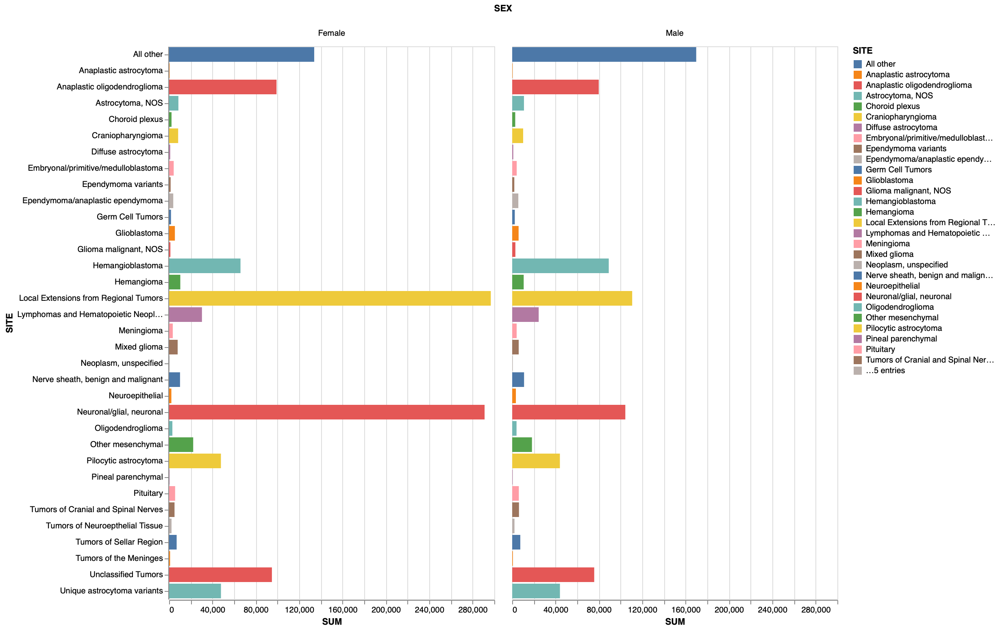
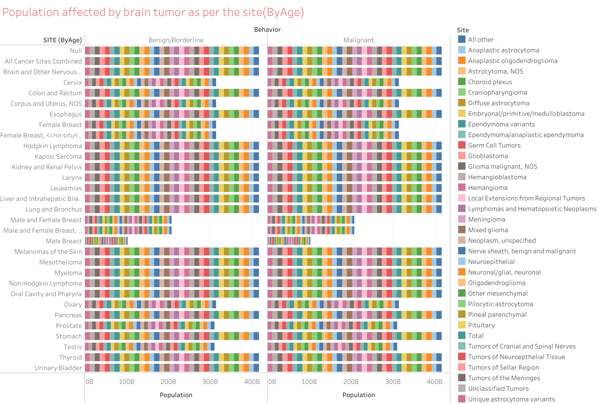

CS625-HW7: Project - Generate In-depth Questions Using EDA
================
Priyanka Vepuri
11/30/2021

#### Centers for Disease Control and Prevention - United States Cancer Statistics (USCS)

I would like to keep the same questions that I produced in HW6. I am
using the sheet named *ByAge* in the excel file as my second dataset for
comparison with the Sheet named as *BrainBySite* which I considered as
my first dataset in hw 6.

I am using Q1 in HW6 and combined the two datasets and produced another
hart as shown below and is named as groupedBar1.

## Using Observable

##### Link: [Dataset](https://www.cdc.gov/cancer/uscs/dataviz/download_data.htm)

##### Link: [Observable Notebook](https://observablehq.com/d/966c110ae3fb0286)

#### Question 1: What is the average age of a person diagnosed, does it differ with gender? Which tumor is observed mostly in the population, and how does it vary with gender?

##### Chart created: 

To know the average AGE with respect to SEX, a groupedBar is used to
group the SEX and plot BEHAVIOUR against the average AGE-ADJUSTED RATE.

**Observation**: From the plot shown above, it is observed that
Benign/Borderline tumor is highly caused in female and Malignant tumor
is highly caused in male. The average AGE of male to be identified with
Malignant tumor is around 8 to 10 where as Benign/Borderline tumor is
around 7 to 8 years. Similarly, The average AGE of female to be
identified with Malignant tumor is around 6 where as Benign/Borderline
tumor is around 17 to 18 years.

The visualization below is used to compare each tumor and how it affects
males and females respectively. For this chart, data manipulation is
required to get the sum of count for all the years. This manipulation is
done using python, and jupyter notebook for the same is attached.

##### Link: [Jupyter Notebook](https://github.com/odu-cs625-datavis/fall21-hw7-priyankavepuri98/blob/master/CS625%20Homework%207.ipynb)

Once the required data is present, the same grouped bar as above is used
to plot SITE against the SUM. The sum is the plot on the horizontal axis
and site on the vertical so that the comparison becomes easier.

From the plot, we can see that Local Extensions from Regional Tumors,
Anaplastic oligodendroglioma, Neuronal, and Unclassified tumors are
highly present in women than in men. Whereas Hemangioblastoma,
Lymphomas, and Hematopoietic Neoplasms, Pilocytic astrocytoma were
observed more in men.

##### Chart created: 

##### Chart created: 

Now to evaluate which will end up being the most effective
representation, let’s compare the above two plots and below is the
observation.

**Observation**: In the above plot, *point* is used instead of
*barplot*. From the plot, it is observed that if point is used, it is
hard to find the highest sum or lowest sum. Also, the chart looks
clumpsy and not understandable. Whereas in barplot we can easily find
the sum with a glance of look.

## Using Tableau

##### Link: [Online Tableau Workbook](https://prod-useast-a.online.tableau.com/t/oducs625/views/Homework7_16383224932960/Sheet1?:showAppBanner=false&:display_count=n&:showVizHome=n&:origin=viz_share_link)

#### Question 2: What is the amount of population affected by brain tumor according to the SITE(ByAge)?

##### Chart created: 

##### Chart created: 

**Observation**: The above chart gives the result of the combined
datasets. First, I have created the line chart using the information.
But, the result was not relevant so I created a barchart using the same
information. The population as per the site is clearly being seen in
this chart. When the cursor is placed on the site, it gives the exact
population count. Most of the sites have the common number of
population. A single color is being shown in line chart whereas in
barplot, it is easier to identify due to the color of the site.

### References:

Didn’t use any references as observable, tableau are used in previous
homeworks. I have knowledge on jupyter from my previous semester.
